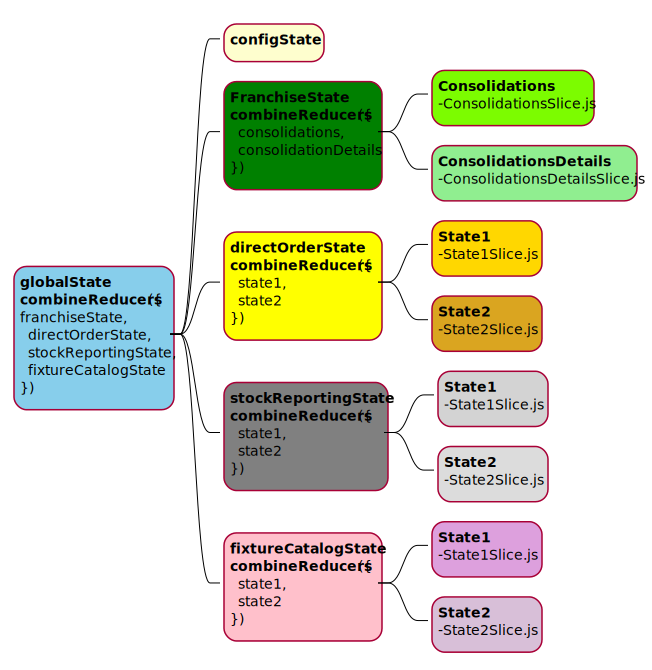
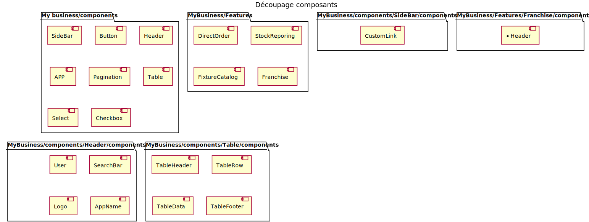

<!-- # SOMMAIRE -->
#Sommaire
 1. [Partie 1. Installation de l'environnement React](#partie-1.-installation-de-l'environnement-react)
    1. [Prérequis](#prérequis) 
    2. [Création d'un projet React](#création-d'un-projet-react) 
        1. [Méthodes](#méthodes)
            1. [Manuel avec webpack et babel](#manuel-avec-webpack-et-babel)
            2. [Create-React-App](#create-react-app)
                1. [Installation de Create-React-App](#create-react-app)
            3. [Vite](#vite)
                1. [Installation de vite](#installation-de-vite)
            4. [Pourquoi VITE plutôt que CRA](#pourquoi-vite-plutôt-que-cra)       
 2. [Partie 2. Comment architecturer son projet React](#partie-2.-comment-architecturer-son-projet-react)
    1. [IHM de référence](#ihm-de-référence)
    2. [Conception technique](#conception-technique)
    3. [React Router](#react-router)
    4. [Gestion des états globaux](#gestion-des-états-globaux)
        1. [Installation de redux et redux-toolkit](#installation-de-redux-et-redux-toolkit)
        2. [Schéma des multiples reducers de notre application](#schéma-des-multiples-reducers-de-notre-application)
        3. [Exemple de gestion d'état de notre config](#exemple-de-gestion-d'état-de-notre-config)
    5. [Découpage des composants](#découpage-des-composants)
        1. [Schéma](#schéma)
        2. [Architecture fichier d'un composant](#architecture-fichier-d'un-composant)
    6. [Gestion Requêtes Api](#gestion-requêtes-api)
        1. [React-Query](#react-query)
            1. [L'interêt factuel d'utiliser React-query](#l'interêt-factuel-d'utiliser-react-query)
                1. [Composant Consolidations sans l'utilisation de react Query](#composant-consolidations-sans-l'utilisation-de-react-query)
                2. [Composant Consolidations avec l'utilisation de react Query](#composant-consolidations-avec-l'utilisation-de-react-query)
    7. [Communication entre les composants](#communication-entre-les-composants)
    8. [Architecture globale des fichiers de l'application](#architecture-globale-des-fichiers-de-l'application)
    9. [Bonnes pratiques](#bonnes-pratiques)
        1. [Séparer la logique du rendu visuel](#séparer-la-logique-du-rendu-visuel)
        2. [Principe de responsabilité unique](#principe-de-responsabilité-unique)
        3. [Destructuration des objets](#destructuration-des-objets)
        4. [Utilisation des propTypes](#utilisation-des-proptypes)
        5. [Utilisation des conditions de rendu](#utilisation-des-conditions-de-rendu) 
        6. [Gestion des classes CSS](#gestion-des-classes-css)	
        7. [Utilisation d'un linter](#utilisation-d'un-linter)
        8. [Utilisation de sonarlint](#utilisation-de-sonarlint)
        9. [Evitez les excès de commentaires](#evitez-les-excès-de-commentaires)
        10. [Librairies pratiques](#librairies-pratiques)

# Partie 1. Installation de l'environnement React 

#### Prérequis 

Installation du serveur et gestionnaire de paquets

node js => https://nodejs.org/en/

## Création d'un projet React
## Méthodes
- ### Manuel avec webpack et babel
   Suivre la prcocédure https://imranhsayed.medium.com/set-up-react-app-with-webpack-webpack-dev-server-and-babel-from-scratch-df398174446d

    **liens utiles:**

    https://babeljs.io/docs/en/babel-preset-react

    https://webpack.js.org/loaders/babel-loader/

- ###  Create-React-App

    #### Installation de Create-React-App
Suivre la prcocédure https://create-react-app.dev/docs/getting-started

- ### Vite
    #### Installation de vite
Suivre la prcocédure https://vitejs.dev/guide/

## II. Pourquoi VITE plutôt que CRA

**CRA**

Create React App est un outil efficace pour créer facilement un projet React, en effet il fournit de nombreuses fonctionnalités utiles telles que le HMR (Hot Module Replacement) ainsi que le serveur de développement. Cependant, il présente un gros inconvénient qui est le manque de performance que ce soit pour le développement ou le build,  surtout pour les gros projets. CRA utilise derriére webpack.

**VITE**

C'est un outil de nouvelle génération pour construire le front, Outil créé par Evan You créateur de vue-js. Il dispose d'une interface de ligne de commande solide qui facilite considérablement le processus de configuration du projet. Il fonctionne très rapidement et possède de nombreuses fonctionnalités intéressantes fournies par CRA. De plus, il existe des plugins qui peuvent être ajoutés et rendent le processus de développement plus simple.
Lorsque CRA et Vite sont comparés, il existe de nombreuses différences en termes d'expérience et de temps de construction. Dans CRA, il n'y a littéralement pas de fichier de configuration pour le processus de construction, tout est super simple. Cela facilite la vie des petits projets, mais lorsque le projet prend de l'ampleur, le processus de construction doit être configuré en fonction des besoins du projet. En revanche, Vite fournit un fichier vite.config.js qui contient des configurations supplémentaires pour le projet et il est vraiment simple et facile à configurer.  

L'autre différence avec CRA est le temps du build de l'application pour le développement, CRA regroupe tous les fichiers de l'application à chaque changement alors que Vite ne regroupe que les fichiers modifiés, d'ou le gain de performance. 

En resumé pour les petits projets CRA peut être suffisant, en revanche utilisez vite si le projet prend de l'ampleur.

# Partie 2. Comment architecturer son projet React

### IHM de référence


### Conception technique 

#### React router

Documentation : https://reactrouter.com/web/guides/quick-start

Dans le contexte de notre IHM, l'application globale aura un router qui redirigera vers chaque features et ensuite chaque feature gére son propre router.

#### Gestion des états globaux

#### Installation de redux et redux-toolkit
Suivre la proccédure de cette documentation https://redux.js.org/introduction/getting-started

#### Schéma des multiples reducers de notre application


#### Exemple de gestion d'état de notre config
Dans ce contexte nous créons un fichier configSlice.js. Cet état nous permettra de mettre à disposition de toute l'application et micro-applications les données du magasin selectionné et celles de l'utilisateur. 

**configSlice.js**
```js configSlice.js
import { createSlice } from '@reduxjs/toolkit';
import { useSelector } from 'react-redux';

const configSlice = createSlice({
  name: 'configSlice',
  initialState: {
    selectedStore: null,
    user: undefined,
  },
  reducers: {
    updateSelectedStore: (state, action) => {
      const selectedStore = { ...state.selectedStore, ...action.payload };
      return { ...state, selectedStore };
    },
    updateUser: (state, action) => ({ ...state, user: action.payload }),
  },
});


// On exporte les fonctions qui nous retournent la valeur associée dans l'état
export const getSelectedStore = (state) => state.config.selectedStore;
export const getUser = (state) => state.config.user;

//On exporte les actions pour les utiliser dans les composants qui vont déclencher l'action au travers d'un dispatch
export const { updateSelectedStore, updateUser } = configSlice.actions;

// On exporte le reducer pour l'intégrer au REDUCER global 
export default configSlice.reducer;

// On export des hooks customisés afin d'éviter la duplication de code dans tous les composants
export const useUser = () => useSelector(getUser);
export const useSelectedStore = () => useSelector(getSelectedStore);
}
``` 

**Déclencher l'action de mise à jour du state config**

Imaginons un composant User.jsx qui affichera le nom de l'utilisateur et qui s'occupera de déclencher l'action nécessaire pour la mise à jour du state global
```jsx 
import { useEffect } from 'react';
import { useDispatch, useSelector } from 'react-redux';
import {useUser, updateUser} from 'configSlice.js'
import {getUser} from 'user/services'

export const User = () => {
    const dispatch = useDispatch();
    // Récupération des données users au travers de notre custom hook
    const user = useUser();

    //dispatch l'action updateUser qui va ensuite mettre à jour le store user de redux avec les données récoltées 

    useEffect(() => {
         dispatch(updateUser(getUser()));
    }, []);

    return <h1>{user?.name}</h1>
    }
 ```
 
### Découpage des composants
Découper l'IHM en composants permet de concéptualiser notre application à savoir les composants qui seront utilisables sur l'application globale ou uniquement par un composant plus restreint. 

A travers le schéma ci dessous, nous avons découpé les composants qui seraient utilisables dans un perimêtre global ou plutôt restreint. Plus on découpe mieux cela est pour la maintenabilité du code.

#### Schéma


#### Architecture fichier d'un composant
Prenons par exemple le composant Button qui est situé dans le perimêtre global, nous découperons le composant ainsi

    ├───Button
        ├───index.jsx
        ├───Button.css
        ├───Services.js
        ├───Services.test.js
        ├───Button.test.jsx
       
Si un composant posséde des composants réutilisables seulement dans ce composant, créer un dossier components dans le perimêtre associé du composant comme par **exemple**

    ───Button
        ├───index.jsx
        ├───Button.css
        ├───Services.js
        ├───Services.test.js
        ├───Button.test.jsx
        ├───Components
            ├───IconButton
                ├───index.jsx
                ├───IconButton.css
                ├───Services.js
                ├───Services.test.js
                ├───IconButton.test.jsx
### Gestion Requêtes Api
#### React-Query
Documentation => https://react-query.tanstack.com/overview

Cette bibliothéque  facilite la récupération, la mise en cache, la synchronisation et la mise à jour de l'état du serveur de nos applications React. Cela permet également d'éviter d'ajouter du code superflux.

Par exemple dans notre [IHM](#ihm-de-référence) nous avons besoin de créer un composant qui renverra une liste de consolidations. Ce composant peut être largement simplifié grace au hook react-query, ce qui simplifie la lisibilité du code en plus de tous les autres avantages liés à cette bibliothéque.

#### L'interêt factuel d'utiliser React-query
##### Composant Consolidations sans l'utilisation de react Query
```jsx
import React, {useEffetct, useState} from 'react'
import {fetchConsolidations } from 'services'

const Consolidations = () => {
    // C'est trois lignes peuvent être éco par react query
    const [data, setData] = useState()
    const [isLoading, setIsLoading] = useState(false)
    const [error, setError] = useState(false)

    // Cette fonction également
    const getConsolidations = async () => {
        setIsLoading(true)
         try {
            setData(await fetchConsolidations())
            setIsLoading(false)
        } catch (error) {
            setIsLoading(false)
            setError(true)
        }
    }

    // le useEffect également
    useEffect(() => {
        getConsolidations()
    }, []);

    if (isLoading) return "Loading...";
    if (error) return <div>Something went wrong.</div>
    return <div>data</div>
} 
```
##### Composant Consolidations avec l'utilisation de react Query
```jsx
import React, from 'react'
import { useQuery } from 'react-query'
import {fetchConsolidations } from 'services'

const Consolidations = () => {
    const { isLoading, error, data } = useQuery('consolidations', () =>fetchConsolidations())

    if (isLoading) return "Loading...";
    if (error) return <div>Something went wrong.</div>
    return <div>data</div>
} 
```

### Communication entre les composants

    - props direct 
    - useContext

### Architecture globale des fichiers de l'application
Si l'on se référe à notre [conception des états](#schéma-des-multiples-reducers-de-notre-application) et [l'inventaire de nos composants](#découpage-des-composants) nous aurions ce genre d'architecture fichiers. L'idée n'est pas de la détailler entiérement mais d'avoir un aperçu de structure de base.

    ───Application
        ├───node_modules
        ├───public
            ├───index.html
        ├───src
            ├───features
                ├───DirectOrder
                    ├───store
                        ├───slices
                    ├───components
                        ├───Component1
                        ├───Component2
                ├───StockReporing
                    ├───store
                        ├───slices
                    ├───components
                        ├───Component1
                        ├───Component2
                ├───FixtureCatalog
                    ├───store
                        ├───slices
                    ├───components
                        ├───Component1
                        ├───Component2
                ├───Franchise
                    ├───store
                        ├───slices
                            ConsolidationsSlice.js;
                            ConsolidationsDetailsSlice.js
                        reducer.js
                    ├───components
                        ├───Header
                        ├───Component2      
            ├───components
                ├───Header
                    ├───components
                        ├───User
                        ├───SearchBar
                        ├───Logo
                        ├───AppName
                ├───Table
                    ├───components
                        ├───TableHeader
                        ├───TableRow
                        ├───TableData
                        ├───TableFooter    
                ├───Button
                ├───SideBar
                    ├───components
                        ├───CustomLink
                ├───Select 
                ├───Checkbox
                ├───Pagination
            ├───store
                index.js
            App.js

###  Bonnes pratiques

#### Séparer la logique du rendu visuel

    - Exemple de custom hooks
    - Bonnes pratiques 

#### Principe de responsabilité unique

#### Destructuration des objets

#### Utilisation des propTypes

#### Utilisation des conditions de rendu 

    - Simplifier la lecture et compréhension du code avec les conditions à la volée plutôt que des ternaires

#### Gestion des classes CSS

    - Package classnames		
    - Package styled components 		

#### Utilisation d'un linter

#### Evitez les excès de commentaires

###  Librairies pratiques


