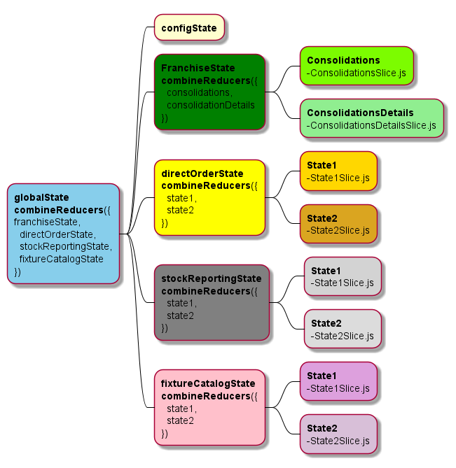

<!-- //summary -->

<!-- ```jsx
const Welcome = (props)  => {
  return <h1>Hello, {props.name}</h1>;
}
``` -->
# Partie 1 - Installation de l'environnement React 

#### Prérequis 

Installation du serveur et gestionnaire de paquets

    - node js 
    - npm 

## A. Création d'un projet React
## I. 3 Solutions
-   ### Manuel avec webpack et babel
    #### 1.  Mise en place du fichier package. JSON
    #### 2.  Installation de React et react dom
    #### 3.  Installation de  babel
    #### 4.  Configurer babel 
    #### 5. Installation de  Webpack et Webpack Dev Server
    #### 6.  Création des dossiers et fichiers du projet
    #### 7.  Configurer webpack
    #### 8.  Création du composant src/App.js
    #### 9.  Fichiers App.js
    #### 10. Fichiers index.html
    #### 11. Insertion du composant App.js dans le dom
    #### 10. Ajouter les scripts dans le package.json et démarrer l'application


-   ###  Create-React-App

    #### 1. Installation de Create-React-App
Suivre la prcocédure https://create-react-app.dev/docs/getting-started

- ### Vite
    #### 1. Installation de vite
Suivre la prcocédure https://vitejs.dev/guide/

## II. Pourquoi vite plutôt que CRA

# Partie 2 - Comment architecturer son projet React

### A. IHM de référence


### B. Conception technique 

#### 1. React router

https://reactrouter.com/web/guides/quick-start

#### 2. Gestion des états globaux
#### Installation de redux et redux-toolkit
Suivre la proccédure de cette documentation https://redux.js.org/introduction/getting-started


## Schéma
Voici le schéma de notre gestion des états



    - Redux@toolkit (actions, reducers, combineReducer) 
    - Mise en exemple par rapport à l'IHM

#### 3. Découpage des composants 

    - Liste des composants et nomination des composants 
    - Communication entre composants 
    - Eviter les rendus superflus
    - Tests des composants (librairies + cas d'utilisations)
    - Exemple de structure des fichiers d'un composant (custom hooks(ex: useFecth, useInput), services, jsx)

#### 4. Requêtes Api

    - fetch, axios 
    - react-query 
    - useEffect

#### 5. Communication entre les composants

    - props direct 
    - useContext

#### 6. Architecture globale  des fichiers 

* schéma 

### C. Bonnes pratiques

#### 1. Séparer la logique du rendu visuel

    - Exemple de custom hooks
    - Bonnes pratiques 

#### 2. Principe de responsabilité unique

#### 3. Destructuration des objets

#### 4. Utilisation des propTypes

#### 5. Utilisation des conditions de rendu 

    - Simplifier la lecture et compréhension du code avec les conditions à la volée plutôt que des ternaires

#### 6. Gestion des classes CSS

    - Package classnames		
    - Package styled components 		

#### 7. Utilisation d'un linter

#### 8. Evitez les excès de commentaires

### D. Librairies pratiques

 
